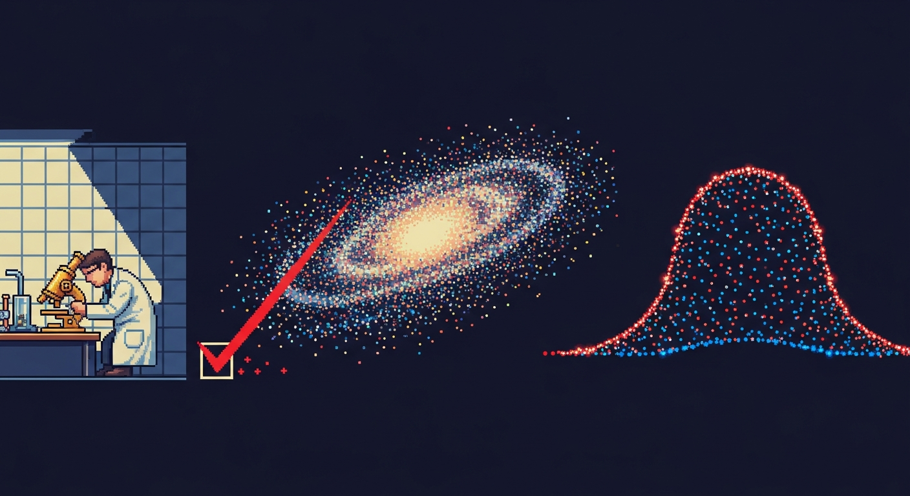

<p align="center">
  
</p>

<p align="center">
  
</p>

<p align="center"><strong>Break your own analysis before Reviewer 2 does.</strong></p>

<p align="center"><em>A statistical-rigor auditor for single-cell RNA-seq. It re-runs the load-bearing statistics on your own data and marks the false discoveries on your own figures, before they become a paper.</em></p>

<p align="center">
  
  
  
  
  
  
  
  
  
</p>

Redline audits the statistics behind a single-cell RNA-seq analysis before that analysis becomes a paper. A scientist hands it their data (an AnnData `.h5ad`) and the analysis they ran. Redline re-runs the load-bearing steps itself, then turns adversarial on the results: it finds where a conclusion is statistically invalid, or only looks significant because of how the data was handled. Every finding lands on the scientist's own figure, names the exact failure mode, cites the method paper that fixes it, and rewrites the conclusion in language that survives peer review.

QC is a solved, commoditized layer, and a generic reviewer reads a finished manuscript. Redline works one level in from both: on your own data and your own code, on the statistical reasoning, before any of it is published. It catches four classes of error that no QC tool and no generic agent flags.

## What it catches

- **Fake significance from non-independent data (pseudoreplication).** Cells from one donor are not independent samples. Testing 40,000 cells as 40,000 observations when they came from four donors inflates type-1 error massively. Redline aggregates counts to one profile per biological replicate and re-runs the comparison correctly with PyDESeq2 (Squair et al. 2021). On screen the tiny p-value gets struck through, the corrected value drops in beside it, and the volcano deflates from fireworks to nearly empty. If a group has fewer than two real replicates, no valid test exists by any method, and Redline states that flatly instead of printing a number. This is the one check where Redline asserts the corrected result.
- **Fake groups (double dipping).** Clusters defined on the data and then tested for their own marker genes on that same data manufacture false positives. It is the default in standard pipelines, and Seurat itself warns about it. Redline splits the counts into two statistically independent halves (Poisson thinning), clusters on one half, tests markers on the other, and reports how many of the claimed markers survive. The claimed marker list collapses on screen. Count splitting is evidence, not a certified FDR correction, and Redline says so and names ClusterDE as the stronger method on the roadmap.
- **Fragile conclusions (clustering instability).** The biological story often rides on an arbitrary clustering resolution the scientist never justified. Redline sweeps the resolution across a range, measures agreement between settings with the adjusted Rand index, and tracks whether a named cluster survives the sweep. A slider re-runs clustering live and the claimed cell state appears and vanishes.
- **Confounded comparisons.** The comparison of interest can be inseparable from a technical variable, for instance when the treated and control samples were processed on different days. Redline builds the design matrix from the confirmed columns, checks whether condition and batch are collinear or fully nested, then re-fits with the technical variable included to see if the effect survives. It flags what cannot be concluded, in plain language. (v1 covers technical-biological confounding; composition shifts are out of scope.)

## Two rules Redline never breaks

- **Auditor, not corrector.** Redline surfaces and quantifies fragility. It does not hand back one authoritative "corrected" result, because for most of these problems the field has no agreed-on fix, and overclaiming a correction is the exact error it exists to catch. Pseudoreplication is the single exception, where the corrected method is accepted and Redline asserts it.
- **Never cry wolf.** When a check passes, Redline says so plainly and confidently. It never manufactures a flag to have something to show. A clean analysis is a real answer, and a passed check renders as **Verified** in green, stated with the same confidence Redline gives a flag. A tool that always finds a problem is a tool nobody trusts.

## How it works

One engine, every surface. The core is a rigor engine that exposes a foundation step plus the four checks, each as an independent MCP tool, and packages as a Claude Skill so the same code drops into Claude Science. A plots-first web workbench renders the scientist's figures and overlays the findings on them.

Before any check runs, a **foundation step** resolves the design. Column names in an `.h5ad` are arbitrary (`donor`, `orig.ident`, `stim`, `batch`, guide IDs), so Claude inspects the `obs` columns and proposes which one is the biological replicate, which is the grouping variable being compared, and which are technical nuisances, each with reasoning and a confidence level. The scientist confirms or corrects it. Nothing else runs until the design is confirmed, because a wrong role makes every downstream flag wrong. Every pillar operates on that resolved role, never on a hardcoded "cell type."

A `ComputeTarget` seam decides where the statistics actually run, behind one return contract:

```text
fixture    locked deterministic demo          (default, always available)
local      spawn the Python engine locally    (real scanpy / PyDESeq2)
cloudrun   dispatch a GCP Cloud Run job        (heavy jobs, isolated)
endpoint   a runner the scientist controls     (SSH cluster or their own cloud)
```

The UI never changes, only the target does. A target that is not yet wired stays disabled and clearly labeled, never a dead control pretending to work.

```text
redline/
├── apps/
│   └── web/            # plots-first workbench (Next.js -> Vercel)               · built
├── packages/
│   ├── contracts/      # @redline/contracts: Zod shapes every surface speaks      · built
│   ├── ui/             # @redline/ui: tokens, palette, React primitives           · built
│   ├── engine/         # orchestration + the ComputeTarget seam + demo fixtures   · built
│   └── reasoning/      # reasoning layer (Claude): names, cites, rewrites the finding · built
└── services/           # Python side, outside the pnpm graph
    ├── rigor/          # scanpy / PyDESeq2 engine: MCP server + GCP Cloud Run job  · built
    └── skill/          # the same engine as a Claude Skill (for Claude Science)    · built
```

Every finding is numbers plus narrative: a `ComputeResult` (the verdict, the stats, the chart payload) from the compute target, merged with a `Narrative` (the named failure mode, the citation, the struck-through claim, the defensible rewrite) from the reasoning layer. Both halves are Zod-typed in `@redline/contracts`, so the fixture, the Python engine, the reasoning layer, and the UI all speak one shape.

## What's inside

| Path | What it is | Status |
|---|---|---|
| `packages/contracts` | `@redline/contracts`: Zod schemas for every shape the system exchanges. Field roles and verdicts (`primitives`), resolved `obs` columns (`fields`), five discriminated chart payloads (`charts`), the compute-plus-narrative finding (`checks`), scenarios and datasets (`dataset`), the reasoning request/response (`reasoning`), and the assembled `AuditReport`. | built |
| `packages/ui` | `@redline/ui`: the design system. The audit-instrument tokens (a light instrument surface, a reserved red for findings, a blue signal), Archivo and JetBrains Mono, and verdict-to-color / verdict-to-label helpers. | built |
| `packages/engine` | Orchestration across the foundation step and the four checks, the `ComputeTarget` dispatch seam, and the locked deterministic fixtures that keep the demo path bulletproof. | built |
| `packages/reasoning` | The reasoning layer. Claude names the failure mode, cites the fixing method, rewrites the conclusion, and writes the clean verdict when a check passes — over the first-party Claude API (the path you run, with your own key) or AWS Bedrock (the hosted demo), with a curated deterministic fallback when no key is set. | built |
| `apps/web` | The plots-first workbench. Next.js, one panel per check with its knobs exposed, findings marked on the figures. Deploys to Vercel. | built |
| `services/rigor` | The real statistics in Python (scanpy, decoupler, PyDESeq2, numpy), exposed as an MCP server and runnable as a GCP Cloud Run job. | built |
| `services/skill` | The rigor engine packaged as a Claude Skill (`SKILL.md` plus scripts), so the same core loads natively into Claude Science. | built |

## The reference dataset

Redline is dataset-agnostic, but it is built and validated against one reference set: the Marson/Pritchard genome-scale CD4+ T-cell Perturb-seq data (Zhu, Dann et al. 2025), Gladstone's flagship single-cell resource and the dataset this hackathon highlighted. It sits on an open S3 bucket (`s3://genome-scale-tcell-perturb-seq/marson2025_data/`, no credentials), MIT licensed, with raw counts so the re-runs are real. Its structure (4 donors, 3 conditions) is a native fit for the pseudoreplication and confounding checks.

The full set is 1.7 TB (individual matrices 15–148 GiB), so the complete four-check recompute runs on a machine with the data, not in the hosted demo. The two small published summary tables (`sample_metadata`, `DE_stats`, MIT) are committed in `services/rigor/data/real/`, and `services/rigor/data/build_real_marson.py` derives real numbers from them with no matrix: the real experimental design and the real batch confound (`culture_condition` × sequencing run, Cramér's V = 0.50 — every 48-hour sample ran in batch R2). The app surfaces those on its Environment page. The matrix-dependent checks (the naive cell-level p, double-dipping AUC, clustering fragility) run through the Python engine (`REDLINE_COMPUTE_TARGET=local`, `redline.remote_adapter`).

One hard rule governs every demo. The authors did their analysis rigorously: they provide pseudobulk matrices and a dedicated DE stage, and the computational lead authored Milo. There is no error in their published work to catch, and Redline never implies otherwise. Redline audits a naive foil instead, the standard cluster-then-annotate-then-DE workflow a less-experienced scientist would run on the same data. Their rigor is the standard Redline helps others reach. Pointed at a clean analysis, Redline reports clean.

## Tech stack

TypeScript, Node 22, pnpm, and turbo, with Zod contracts binding every surface. React 19 and Next.js for the workbench. Python with scanpy, decoupler, and PyDESeq2 for the real statistics: pseudobulk differential expression, count-split reclustering, Leiden resolution sweeps, and design-matrix rank checks. Claude writes the reasoning layer — the failure-mode name, the citation, the defensible rewrite — over the first-party Claude API, or AWS Bedrock for the hosted demo. MCP for the engine surface, packaged as a Claude Skill for Claude Science. GCP Cloud Run for the heavy jobs, Vercel for the web app.

## Getting started

Requires Node 22 or newer and pnpm.

```bash
git clone https://github.com/pablomanjarres/redline.git
cd redline

pnpm install
pnpm build        # builds the four packages, then the Next.js workbench
pnpm typecheck
pnpm test         # engine fixtures (26) + reasoning (7)
```

### Configuration

Copy `.env.example` to `.env.local` and set only what you need. Nothing is hardcoded.

```bash
# Reasoning — Claude. Set a key and Claude writes the findings; unset = curated fallback.
ANTHROPIC_API_KEY=sk-ant-...                # first-party Claude API (the path you run)
# REDLINE_ANTHROPIC_MODEL=claude-opus-4-8   # optional; defaults to Claude Opus 4.8
# The hosted demo pins AWS Bedrock instead (REDLINE_REASONING_BACKEND=bedrock) — see .env.example.

# Where the heavy statistics run: fixture (default) | local | cloudrun | endpoint
REDLINE_COMPUTE_TARGET=fixture

# Reference dataset: open S3, no credentials required, MIT licensed.
REDLINE_S3_BUCKET=genome-scale-tcell-perturb-seq
REDLINE_S3_PREFIX=marson2025_data/
```

## Status

Hackathon v1. Built for **Built with Claude: Life Sciences** (Anthropic × Gladstone Institutes).

The stack is on disk and runs end to end: the contracts and design system, the orchestration engine with its `ComputeTarget` seam and the locked fixtures, the plots-first workbench (deployed to Vercel), the Claude reasoning layer (first-party Claude API, or Bedrock for the hosted demo, with a curated fallback), and the Python rigor service (the four checks, the MCP server, the Cloud Run job runner, and the Claude Skill packaging). The `next build` is green, and the demo runs on the fixture target with zero cloud credentials. Point `REDLINE_COMPUTE_TARGET` at the Python engine to run the real statistics on your own `.h5ad`.

## License

MIT. See [LICENSE](./LICENSE).

---

<p align="center">
  Built with Claude: Life Sciences (Anthropic × Gladstone Institutes) · Built by Pablo Manjarres
</p>
