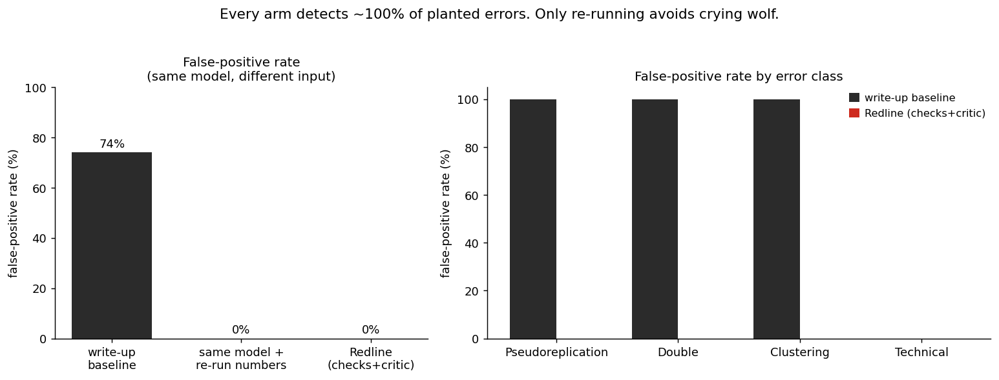

# Redline detection benchmark

A small, open benchmark that measures how well Redline detects planted
statistical errors in single-cell RNA-seq analyses, against a single Claude call
given the same analysis. It quantifies what the scaffolding buys: if a single
model call scored the same, the deterministic checks and the critic would be
pointless. It does not.

## Headline

> **Redline catches 100% of planted errors at a 0% false-positive rate; a single
> Claude call catches 100% at 74%.** (Opus 4.6 powers the LLM calls in both arms.)

Every arm catches the planted errors. The difference is precision: the write-up
call cannot tell a real effect from a pseudoreplication artifact, or real markers
from double-dipped ones, without running the test, so it flags the method risk
everywhere and cries wolf on clean analyses. The clincher is the third arm: give
the **same model the re-run numbers** instead of the write-up and its
false-positive rate collapses from 74% to 0%. The false positives were the cost of
not re-running, and re-running is exactly what Redline does.

| Arm | Detection | False-positive rate | Precision | F1 | Youden's J |
|---|---|---|---|---|---|
| Single Claude call, write-up only (baseline) | 100% | 74% | 21% | 34% | 0.26 |
| Single Claude call, given the re-run numbers | 100% | 0% | 100% | 100% | 1.00 |
| Redline checks (no critic) | 100% | 2% | 91% | 95% | 0.98 |
| **Redline checks + critic** | **100%** | **0%** | **100%** | **100%** | **1.00** |

The critic can only remove flags, never add them. It turned the four checks'
raw 2% false-positive rate into 0% by vetoing three borderline fragility flags
(a state present in 60-70% of the resolution sweep is not a resolution artifact),
each with an evidence-grounded reason. That is the "never cry wolf" invariant,
measured.



## Why this is the right measurement

The master brief's motivation: on a benchmark of real paper-vs-code discrepancies
(SciCoQA), even the best models caught only ~47%. Naive "review my analysis"
fails. The value is in the scaffolding: actually executing the diagnostic code
instead of reading it. This benchmark isolates that value.

The result is a precision story, not a recall story, and that is the honest and
more interesting finding. A strong reviewer model, given a good prompt, will flag
a method risk whenever the method is described, so it catches the errors (high
recall) at the cost of flagging sound analyses too (low precision). Redline is
high recall AND high precision, because it re-runs the test and settles what the
write-up cannot. The false-positive gap (0% vs 74%) is the hard evidence behind
"never cry wolf."

## The two arms

- **Redline arm** runs the real `redline` engine (the same four checks the product
  ships: pseudoreplication, double dipping, clustering fragility, confounding) on
  each case's data, then an LLM **critic** reviews each raw flag against the re-run
  evidence and vetoes weak ones. This is the shipped "four checks + critic"
  pipeline, not a reimplementation.
- **Baseline arm** gives a single Claude call the scientist's analysis write-up
  (the claim, the naive test they ran, the marker list, the clustering resolution,
  the batch design) and asks it to find the statistical problems. This is what
  Reviewer 2 sees. The prompt is strong and fair (it names and defines all four
  error classes, cites the fixing method for each, and asks the model to neither
  miss real problems nor invent ones). A weak prompt would rig the comparison.

Both arms use the **same model** (`us.anthropic.claude-opus-4-6-v1`, the strongest
this account can invoke), so the only variable is the scaffolding.

## Integrity of the ground truth (read this honestly)

The obvious failure would be circularity: defining "correct" as "what the engine
says," so the engine scores 100% by construction. This benchmark reduces that risk
but does not fully escape it, and the honest accounting matters more than a clean
number:

- **The labeler is a separate implementation but not method-independent.**
  `labeler.py` recomputes each error from scratch and never imports the engine, but
  it applies the same core statistics the engine runs (Welch t, Poisson count-split
  held-out AUC, a resolution sweep, Cramer's V). So agreement is a consistency
  check, not proof of correctness, and it is strongest where the two share the most.
- **For pseudoreplication and confounding the truth is definitional by construction.**
  The generator plants a donor outlier with too few replicates, and makes the batch
  collinear with the condition. Those cases are true by how they were built; the
  labeler is a sanity check on them, not an oracle. For double dipping and fragility
  the labeler retains a little more independence (it scores the given state mask on
  a held-out split, and sweeps KMeans over an explicit k-grid, with a seed distinct
  from the engine's), but in this environment the engine's own clustering also falls
  back to KMeans (leiden is unavailable), so the two share the clustering primitive
  and differ only in grid and seed. Treat the agreement as weak, not as validation.
- **Cases are tuned against the labeler, never against the engine or the baseline,**
  and filtered to a clear decision margin (`generate.py` `_accept`), which makes the
  labels unambiguous but also removes the borderline cases where the engine would be
  most likely to slip. This is a real limitation, disclosed below.
- **Consequence:** the Redline arm shares its statistical method AND its case
  selection with the grader, so its detection rate is near-definitional and should
  not be read as an independent validation. The load-bearing, fair result is the
  false-positive gap between the arms that see the re-run and the write-up baseline
  that does not (next section).
- **The harness is proven able to fail.** `selftest.py` checks that a null arm
  scores 0% detection, a flag-everything arm scores 100% false positives, the
  scorer arithmetic is correct, generation and labeling are deterministic, and
  replay never fabricates a missing call. Run `python -m bench.selftest`.

## Three arms, so the result attributes cleanly

Both LLM arms use the same model; only the input differs.

- **Write-up baseline** reasons over the naive analysis write-up (what Reviewer 2
  has). It cannot re-run the test, so on the three classes whose write-up is
  identical for the sound and the broken analysis (pseudoreplication, double
  dipping, fragility) it must either miss or cry wolf. It cries wolf.
- **Evidence baseline** is the same model handed the re-run diagnostic numbers (the
  cell-level vs pseudobulk p, the discovery vs held-out AUC, the resolution
  stability, the Cramer's V), but not Redline's verdict. It recovers. That is the
  key control: it shows the write-up baseline's false positives are the cost of not
  re-running, not of weak reasoning.
- **Redline** is the pipeline that produces those numbers (four deterministic checks
  + a critic that only removes flags).

The value being measured is the re-run, isolated from reasoning by the gap between
the write-up baseline and the evidence baseline.

## The case set

46 cases, each a small seeded `.h5ad` (720 cells x ~100 genes) built to carry a
known error or none, organized for coverage of every class:

| Family | n | Planted (per the labeler) |
|---|---|---|
| `p1` pos / neg | 6 / 6 | pseudoreplication present / a real donor-consistent effect |
| `spurious_state` | 6 | double dipping AND fragility (a fake over-clustered state) |
| `real_state` | 6 | nothing (a genuine, tight, reproducible state) |
| `continuum` | 6 | fragility only (real markers, resolution-dependent boundary) |
| `p4` pos / neg | 6 / 6 | confounding present / a balanced, separable design |
| `clean_control` | 4 | nothing on any pillar |

That yields 30 planted-error pillar-instances and 154 genuinely-clean ones. The
`spurious_state` vs `real_state` and `continuum` vs `real_state` pairs are the
crux: their write-ups are indistinguishable, so the baseline must either miss or
cry wolf, while Redline's held-out re-test tells them apart.

## Fairness and honesty

- Both arms are reported in full, including where Redline was imperfect (the raw
  checks had a 2% false-positive rate before the critic).
- The false-positive rate is reported as prominently as detection, per class and
  on the clean controls. A one-sided detection number would not be credible.
- The baseline gets a genuinely strong prompt and the strongest available model,
  and its output shows expert-level reasoning (it correctly clears a confound when
  the design is balanced and flags it when it is not). Its false positives are
  appropriate methodological caution that reads as crying wolf only because it
  cannot run the test. That is the point, honestly measured, not a rigged loss.
- **Limitations.**
  - The cases are small and synthetic (the shipped product runs the same checks on
    real `.h5ad`), and the case set is generate-and-filtered to a clear labeler
    margin, so borderline cases (where the engine is likeliest to slip) are absent.
  - The differentiation is precision, not recall: every arm catches the planted
    errors, so the headline is entirely the false-positive gap. A one-number
    "detection" reading would be misleading.
  - The write-up baseline is judged partly on information the write-up withholds
    (the discriminating statistic), which is realistic for a naive analysis but is
    why the evidence baseline is included as the fair control.
  - Redline's 0% false-positive rate is a knife-edge: the four deterministic checks
    alone produce a nonzero rate (a few borderline fragility flags), and the critic,
    an LLM step, is what removes them. The `redline_raw` row shows the pre-critic
    number so this is not hidden.
  - The engine runs its deterministic path (Welch for pillar 1, KMeans for
    clustering since leiden is unavailable, PyDESeq2 absent), recorded in
    `results.json` under `meta.engine_backend`, so `--replay` reproduces exactly in
    that environment; production may use leiden/PyDESeq2 instead. The number is
    frozen for one model; the harness re-runs against any Bedrock model.

## Reproduce

Three paths, strongest guarantee first:

```bash
cd services/rigor
uv venv --python 3.12 .venv
VIRTUAL_ENV=.venv uv pip install -r bench/requirements-lock.txt
VIRTUAL_ENV=.venv uv pip install -e . --no-deps      # the redline engine, pinned deps

# 1) Recompute the headline from the committed per-case outcomes. No compute, no
#    model, no credentials, environment-independent.
.venv/bin/python -m bench.run --score-only

# 2) Re-run the full pipeline from the committed transcripts (re-runs the four
#    deterministic checks locally, replays every model call). No credentials.
.venv/bin/python -m bench.run --replay

# 3) Prove the harness can fail:
.venv/bin/python -m bench.selftest

# 4) Re-run live against Bedrock (records new transcripts on a cache miss):
AWS_REGION=us-east-1 REDLINE_BENCH_MODEL=us.anthropic.claude-opus-4-6-v1 \
  .venv/bin/python -m bench.run --live

# Rebuild the case set from scratch (deterministic):
.venv/bin/python -m bench.generate
```

`--score-only` reproduces the number from `results.json` alone in any
environment. `--replay` serves every model call from `transcripts/llm_calls.jsonl`
(the full prompts and responses are stored, so the eval is auditable) and re-runs
the deterministic checks; it reproduces exactly in the pinned environment
(`requirements-lock.txt`; note that PyDESeq2 is intentionally absent, so the
engine takes its deterministic Welch/KMeans path). `--live` calls Bedrock only for
prompts not already recorded.

## Layout

```
bench/
  spec.py          constants, paths, and the labeler's decision thresholds
  generate.py      the single-error foil generator (+ clean controls)
  labeler.py       the INDEPENDENT numpy/scipy ground-truth labeler
  artifact.py      renders each case as the analysis write-up the baseline audits
  redline_arm.py   runs the real engine's four checks on a case
  critic.py        the LLM critic (the "+ critic" half of the Redline arm)
  baseline.py      the single Claude call (the baseline arm)
  llm.py           Bedrock transport with record/replay
  score.py         per-class + overall detection, false-positive rate, report, figure
  run.py           the orchestrator (--live / --replay / --generate)
  selftest.py      proves the harness can fail
  cases/           the seeded .h5ad cases + manifest.json + labels.json
  transcripts/     the committed LLM record/replay cache
  results/         results.json, report.md, detection_by_class.png
```

## Lineage

The single-error generator draws on the planting patterns in
`services/rigor/data/build_naive_foil.py` and the acceptance spec's four-case
foil work, and follows its "independent oracle, not a tautology" principle for
the labeler. It differs in isolating one error class per case (plus clean
controls) so per-class detection and false-positive rates are measurable.
